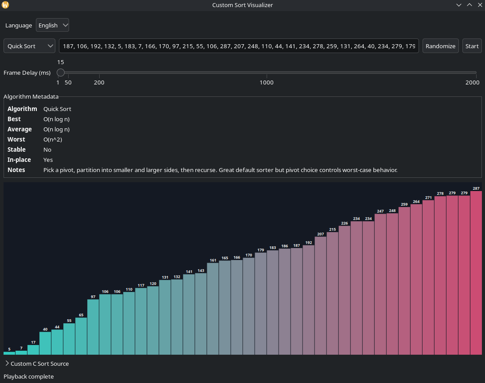

# Custom Sort Visualizer (C + GTK)

Custom Sort Visualizer is a desktop application written in C with GTK that animates how sorting algorithms transform an array over time. The application is intended for learning, experimentation, and algorithm comparison. You can run classic built-in sorting algorithms, inspect algorithm metadata in the interface, tune playback speed, and provide your own custom C implementation to extend the sorter set without modifying core application code.

The visualizer accepts a user-defined integer array, captures intermediate states as animation frames, and plays those frames in the chart area so every swap and movement can be observed. It also highlights imminent swaps and shows per-bar values to make behavior easier to follow during execution.



## Supported Algorithms

The built-in catalog includes Quick Sort, Merge Sort, Heap Sort, Bubble Sort, Selection Sort, Insertion Sort, Gnome Sort, Shaker Sort, Odd Even Sort, Pancake Sort, Bitonic Sort, Radix Sort, Shell Sort, Comb Sort, Bogo Sort, and Stooge Sort. Each algorithm is presented through a shared execution interface so the UI can run and animate them consistently.

## Recommended Build Method (CMake)

CMake is the recommended way to build this project because it is the most portable workflow across Linux, Windows, and other development environments. It also builds all required binaries, including the optional custom-sort worker executable used by isolated execution paths.

### Prerequisites by Platform

All platforms need these core tools:

- A C11-capable compiler
- CMake (3.16 or newer recommended)
- pkg-config
- GTK 3 development files (including GLib and GModule)

Windows (MSYS2/MinGW-w64 recommended):

- Install MSYS2 and use the MinGW 64-bit shell.
- Install packages: mingw-w64-x86_64-toolchain, mingw-w64-x86_64-cmake, mingw-w64-x86_64-pkgconf, mingw-w64-x86_64-gtk3.

Linux:

- Install your distro's GCC or Clang toolchain, CMake, pkg-config, and GTK 3 development package.
- Fedora example: gcc, cmake, pkgconf-pkg-config, gtk3-devel, glib2-devel.
- Debian/Ubuntu example: build-essential, cmake, pkg-config, libgtk-3-dev, libglib2.0-dev.

macOS:

- Install Xcode Command Line Tools.
- Install Homebrew packages: cmake, pkg-config, gtk+3.

FreeBSD:

- Install packages: cmake, pkgconf, gtk3, glib, and a C compiler (for example via llvm or base system clang).

Use the following commands:

```bash
cmake -S . -B build
cmake --build build
./build/sort-visualizer
```

If you prefer Make, this project also provides a Makefile-based path:

```bash
make
./sort-visualizer
```

## Testing and Line Coverage

Run the test suite with CMake:

```bash
ctest --test-dir build --output-on-failure
```

To generate line coverage, install `lcov` and run a dedicated coverage build:

```bash
cmake -S . -B build-coverage -DENABLE_COVERAGE=ON
cmake --build build-coverage
cmake --build build-coverage --target coverage
```

The `coverage` target enforces at least 85% line coverage for `src/main.c` and `src/sort_engine.c` (with bogo-sort lines excluded in source).

This generates:

- `build-coverage/coverage.info` (lcov data)
- `build-coverage/coverage-html/index.html` (HTML report)

### Coverage Report From CI Artifacts

The CI workflow also publishes coverage outputs for each run of `Coverage (Linux)`:

- `coverage-html` artifact includes:
    - `coverage-summary.txt` (text summary from `lcov --summary`)
    - `coverage.info` (raw lcov data)
    - `coverage-html/` (HTML report)

Download these from the workflow run page:

1. Open [CI workflow runs](https://github.com/horserosemilkshake/custom-sort-visualizer/actions/workflows/ci.yml).
2. Select a run and open the `Coverage (Linux)` job.
3. Download the `coverage-html` artifact from the Artifacts section.

## Release Packaging

This repository includes release scripts and a dedicated GitHub Actions workflow for shipping Linux and Windows binaries.

Linux AppImage:

```bash
bash scripts/release/build_appimage.sh
```

The script writes the final AppImage to `dist/`.

Windows `.exe` bundle (run in MSYS2 MinGW64 shell):

```bash
bash scripts/release/build_windows_bundle_msys2.sh
```

The script writes `sort-visualizer.exe` and required runtime DLLs to `dist/windows/`.

Automated release builds:

- Workflow file: `.github/workflows/release.yml`
- Triggers: manual run (`workflow_dispatch`) and tags matching `v*`
- Outputs: Linux AppImage artifact and Windows bundle artifact, with tagged runs also publishing release assets.

## Using the Application

After launch, choose an algorithm from the algorithm selector and enter integers using commas or spaces. Press Start to execute and animate the selected algorithm. You can adjust the frame delay slider between 1 ms and 2000 ms to speed up or slow down playback, and speed changes apply immediately while playback is active.

The top toolbar includes language selection, with English as the default and Chinese (Simplified and Traditional) available. Most interface text, metadata labels, and status messages are localized. Runtime errors originating from parsing, compilation, or sort execution are translated on demand in Chinese modes; when translation is unavailable, the original English message is shown.

The metadata section displays algorithm-level details such as best/average/worst complexity, stability, in-place behavior, and explanatory notes to help with interpretation and study.

## Custom C Sort Extension

The interface includes a collapsible Custom C Sort Source section where you can provide your own sort function. The function contract is:

```c
int custom_sort(int *arr, size_t n,
                void (*swap_cb)(size_t,size_t,void*),
                void *user_data)
```

The custom function should return `0` on success. For frame-accurate animations, call `swap_cb(i, j, user_data)` whenever two elements are swapped. Direct array mutation is also allowed; the final state is still captured and displayed.

Compile your custom code from the UI, switch to the compiled custom algorithm option, and run it like any built-in algorithm.

## Custom Sort Execution Safety

Custom sort handling is designed with portability and safety in mind. On Linux/macOS, custom sort execution uses a worker-process model when available, where the UI process and worker exchange frames and status through IPC and execution is bounded by a timeout (currently 5000 ms). On Windows builds, dynamic loading uses GLib `GModule`, and custom execution uses the compatibility path currently implemented for that platform.

## Limits

Bogo Sort is intentionally constrained to arrays of at most 10 elements and Stooge Sort is constrained to arrays of at most 200 elements to avoid extreme runtimes and keep the UI responsive.
